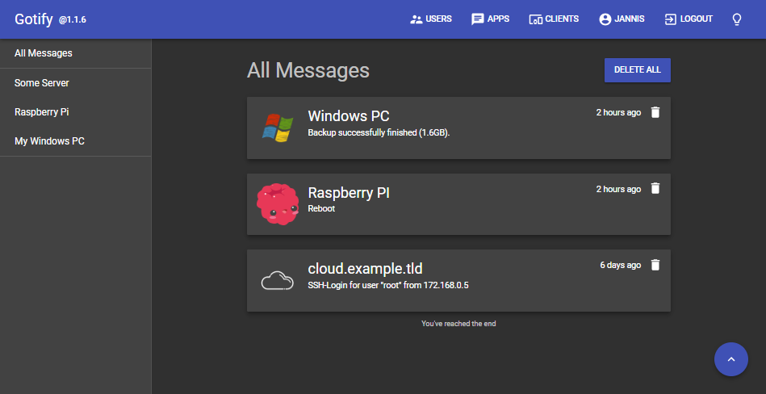

# Gotify Server
[![Build Status][badge-travis]][travis]
[![codecov][badge-codecov]][codecov]
[![Go Report Card][badge-go-report]][go-report]
[![Swagger Valid][badge-swagger]][swagger]
[![FOSSA Status][fossa-badge]][fossa]
[![Api Docs][badge-api-docs]][api-docs]
[![latest release version][badge-release]][release]


   * [Motivation](#motivation)
   * [Features](#features)
   * [Installation](#installation)
   * [Configuration](#configuration)
   * [Push Message Examples](#push-message-examples)
   * [Setup Dev Environment](#setup-dev-environment)
   * [Building](#building)
   * [Tests](#tests)
   * [Versioning](#versioning)
   * [License](#license)

## Motivation
We wanted a simple server for sending and receiving messages (in real time per web socket). For this, not many open source projects existed and most of the existing ones were abandoned. Also, a requirement was that it can be self-hosted. We know there are many free and commercial push services out there.

## Features



* send messages via REST-API
* receive messages via web socket
* manage users, clients and applications
* [API Docs][api-docs] (also available at `/docs`)
* Web-UI -> [./ui](ui)
* CLI for sending messages -> [gotify/cli](https://github.com/gotify/cli)
* Android-App -> [gotify/android](https://github.com/gotify/android)

[][playstore]
[][fdroid]

Google Play and the Google Play logo are trademarks of Google LLC.

## Installation

### Docker
The docker image is available on docker hub at [gotify/server][docker-normal].

``` bash
$ docker run -p 80:80 -v /etc/gotify/data:/app/data gotify/server
```
Also there is a specific docker image for arm-7 processors (raspberry pi), named [gotify/server-arm7][docker-arm7].
``` bash
$ docker run -p 80:80 -v /etc/gotify/data:/app/data gotify/server-arm7
```
`/app/data` contains the database file (if sqlite is used), images for applications and cert-files (if lets encrypt is enabled).

### Binary
Visit the [releases page](https://github.com/gotify/server/releases) and download the zip for your OS.

## Configuration
### File

When strings contain reserved characters then they need to be escaped.
[List of reserved characters and how to escape them](https://stackoverflow.com/a/22235064/4244993).

``` yml
server:
  port: 80 # the port for the http server
  ssl:
    enabled: false # if https should be enabled
    redirecttohttps: true # redirect to https if site is accessed by http
    port: 443 # the https port
    certfile: # the cert file (leave empty when using letsencrypt)
    certkey: # the cert key (leave empty when using letsencrypt)
    letsencrypt:
      enabled: false # if the certificate should be requested from letsencrypt
      accepttos: false # if you accept the tos from letsencrypt
      cache: data/certs # the directory of the cache from letsencrypt
      hosts: # the hosts for which letsencrypt should request certificates
      - mydomain.tld
      - myotherdomain.tld
  responseheaders: # response headers are added to every response (default: none)
    Access-Control-Allow-Origin: "*"
    Access-Control-Allow-Methods: "GET,POST"
  stream:
    allowedorigins: # allowed origins for websocket connections (same origin is always allowed)
      - ".+.example.com"
      - "otherdomain.com"
database: # for database see (configure database section)
  dialect: sqlite3
  connection: data/gotify.db
defaultuser: # on database creation, gotify creates an admin user
  name: admin # the username of the default user
  pass: admin # the password of the default user
passstrength: 10 # the bcrypt password strength (higher = better but also slower)
uploadedimagesdir: data/images # the directory for storing uploaded images
```

You can also copy the example file `config.example.yml` to `config.yml` and edit it.

### Environment

Escaped characters in list or map environment settings (`GOTIFY_SERVER_RESPONSEHEADERS` and
`GOTIFY_SERVER_SSL_LETSENCRYPT_HOSTS`) need to be escaped as well.
[List of reserved characters and how to escape them](https://stackoverflow.com/a/22235064/4244993).

``` bash
GOTIFY_SERVER_PORT=80
GOTIFY_SERVER_SSL_ENABLED=false
GOTIFY_SERVER_SSL_REDIRECTTOHTTPS=true
GOTIFY_SERVER_SSL_PORT=443
GOTIFY_SERVER_SSL_CERTFILE=
GOTIFY_SERVER_SSL_CERTKEY=
GOTIFY_SERVER_SSL_LETSENCRYPT_ENABLED=false
GOTIFY_SERVER_SSL_LETSENCRYPT_ACCEPTTOS=false
GOTIFY_SERVER_SSL_LETSENCRYPT_CACHE=certs
# lists are a little weird but do-able (:
GOTIFY_SERVER_SSL_LETSENCRYPT_HOSTS=- mydomain.tld\n- myotherdomain.tld
GOTIFY_SERVER_RESPONSEHEADERS="Access-Control-Allow-Origin: \"*\"\nAccess-Control-Allow-Methods: \"GET,POST\""
GOTIFY_SERVER_STREAM_ALLOWEDORIGINS="- \".+.example.com\"\n- \"otherdomain.com\""
GOTIFY_DATABASE_DIALECT=sqlite3
GOTIFY_DATABASE_CONNECTION=gotify.db
GOTIFY_DEFAULTUSER_NAME=admin
GOTIFY_DEFAULTUSER_PASS=admin
GOTIFY_PASSSTRENGTH=10
GOTIFY_UPLOADEDIMAGESDIR=images
```

### Database
| Dialect   | Connection                                                           |
| :-------: | :------------------------------------------------------------------: |
| sqlite3   | `path/to/database.db`                                                |
| mysql     | `gotify:secret@/gotifydb?charset=utf8&parseTime=True&loc=Local `     |
| postgres  | `host=localhost port=3306 user=gotify dbname=gotify password=secret` |

When using postgres without SSL then `sslmode=disable` must be added to the connection string.
See [#90](https://github.com/gotify/server/issues/90).

## Push Message Examples

You can simply use [curl](https://curl.haxx.se/), [HTTPie](https://httpie.org/) or any other http-client to push messages.

An application-token can be obtained from the apps tab inside the UI or using the REST-API (`/application`).

```bash
$ curl -X POST "https://push.example.de/message?token=<apptoken>" -F "title=my title" -F "message=my message"
$ http -f POST "https://push.example.de/message?token=<apptoken>" title="my title" message="my message"
```
[More examples can be found here](ADD_MESSAGE_EXAMPLES.md)

Also you can use [gotify/cli](https://github.com/gotify/cli) to push messages.
The CLI stores url and token in a config file.

```bash
$ gotify push -t "my title" -p 10 "my message"
$ echo my message | gotify push
```

## Setup Dev Environment

### Setup Server
Download go dependencies with [golang/dep](https://github.com/golang/dep).
```
$ dep ensure
```
Run golang server.
```
$ go run app.go
```

### Setup UI
*Commands must be executed inside the ui directory.*

Download dependencies with [npm](https://github.com/npm/npm).
``` bash
$ npm install
```
Star the UI development server.
``` bash
$ npm start
```
Open `http://localhost:3000` inside your favorite browser.

The UI requires a Gotify server running on `localhost:80` this can be adjusted inside the [ui/src/index.tsx](ui/src/index.tsx).

## Building

### Build Server
``` bash
$ go build app.go
```

### Build UI
``` bash
$ npm run build
```

### Cross-Platform
The project has a CGO reference (because of sqlite3), therefore a GCO cross compiler is needed for compiling for other platforms. See [.travis.yml](.travis.yml) on how we do that.

## Tests
The tests can be executed with:
``` bash
$ make test
# or
$ go test ./...
```

## Versioning
We use [SemVer](http://semver.org/) for versioning. For the versions available, see the
[tags on this repository](https://github.com/gotify/server/tags).

## License
This project is licensed under the MIT License - see the [LICENSE](LICENSE) file for details

 [badge-api-docs]: https://img.shields.io/badge/api-docs-blue.svg
 [badge-swagger]: https://img.shields.io/swagger/valid/2.0/https/raw.githubusercontent.com/gotify/server/master/docs/spec.json.svg
 [badge-go-report]: https://goreportcard.com/badge/github.com/gotify/server
 [badge-codecov]: https://codecov.io/gh/gotify/server/branch/master/graph/badge.svg
 [badge-travis]: https://travis-ci.org/gotify/server.svg?branch=master
 [badge-release]: https://img.shields.io/github/release/gotify/server.svg
 [release]: https://github.com/gotify/server/releases/latest
 [travis]: https://travis-ci.org/gotify/server
 [codecov]: https://codecov.io/gh/gotify/server
 [go-report]: https://goreportcard.com/report/github.com/gotify/server
 [swagger]: https://github.com/gotify/server/blob/master/docs/spec.json
 [api-docs]: https://gotify.github.io/api-docs/
 [docker-normal]: https://hub.docker.com/r/gotify/server/
 [docker-arm7]: https://hub.docker.com/r/gotify/server-arm7/
 [playstore]: https://play.google.com/store/apps/details?id=com.github.gotify
 [fdroid]: https://f-droid.org/de/packages/com.github.gotify/
 [fossa]: https://app.fossa.io/projects/git%2Bgithub.com%2Fgotify%2Fserver
 [fossa-badge]: https://app.fossa.io/api/projects/git%2Bgithub.com%2Fgotify%2Fserver.svg?type=shield
